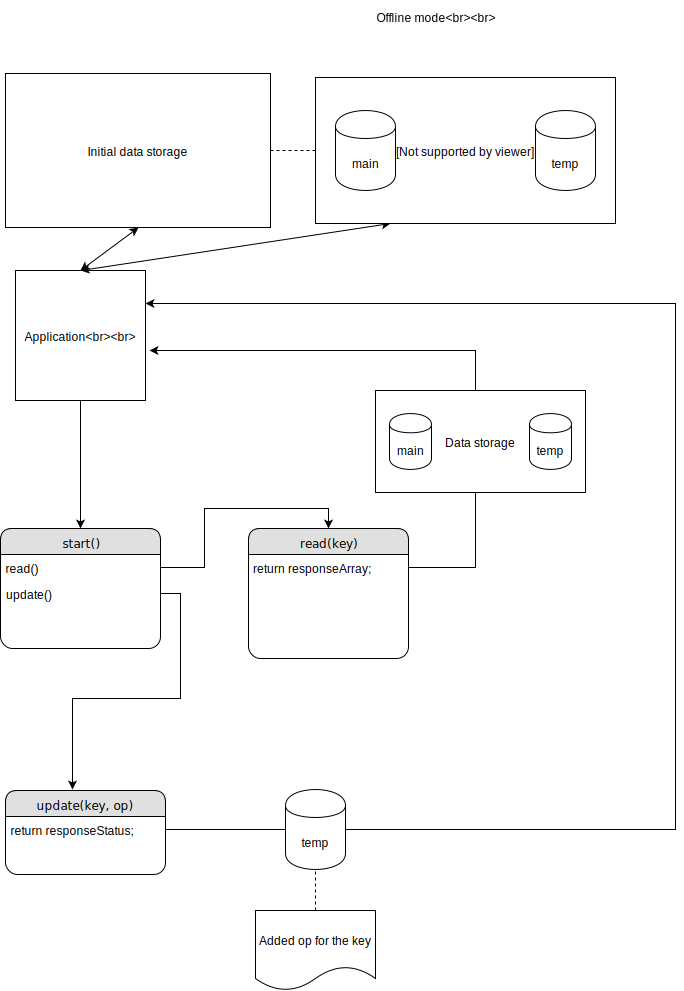

# Pseudocode 


#### The client is offline 



###### start() function 

````pseudocode
function start(){
    read(); // read the latest changes.
    
    changesAwaiting = add listener to the event 'push changes'
    changesAdded = add listener for already added changes
    
    if (changesAwaiting){
     	update();   
    }
    
    if (changesAdded){
        connect();
    }
    
}
````

###### read() function 

```pseudocode
// Read function that pulls database changes
// @param key: the key of the object, for which the update was requested; if undefined, then all changes will be pulled

function read(key) {
    responseArray = []; // define an empty array, which is going to be sent back
    if (main database is not empty) {
        if (key is not undefined) {
            state = get state of object by key from the main database
            operations = get operations performed on the object o from the temp database
            apply operations over the state
            response = object that contains the key and the value
            responseArray.push(response);
        } else {
            for (every key in the main database) {
                state = get state of object by key
                for (every key in the temp database) {
                    operations = get operations performed on the object o;
                    apply operations over the state
                    response = object that contains the key and the value
                    responseArray.push(response);
                }
            }
        }
    }

    return reponseArray;
}
```

###### update() function 

````pseudocode
// update function that processes user-made update
// @param key
// @param op: 
function update(key, op){
    if (key is found in the main database){
        add op to the temp database for the found key;
    }
    else {
        newop = create a key;
        add newop to the temp database;
        add op to the temp database for the key;
        // or maybe we can just notify the user that there is no such key in the main database
    }
    
    return responseStatus;
}
````

#### The client is online

###### read() function

````pseudocode
// Read function that pulls database changes
// @param key: the key of the object, for which the update was requested; if undefined, then all changes will be pulled

function read(key){
     responseArray = []; // define an empty array, which is going to be sent back
    
     connect();
	
     state = get the state of key from the main database;
     response = object that contains the key and the value
     responseArray.push(response);
}
````

###### update() function 

```` fdsf 
// update function that processes user-made update
// @param key
// @param op: 
function update(key, op){
    if (key is found in the main database){
        add op to the temp database for the found key;
    }
    else {
        newop = create a key;
        add newop to the temp database;
        add op to the temp database for the key;
    }
    
    send created operations to the server
    when the response is received:
    	update the main database
    	clean the temp database
    	
	return responseStatus;
}
````

###### connect() function

````pseudocode
function connect(){
	request = GET request;
    if (temp database is not empty){
   		request = POST request with data from temp database;
    }
    send request to the server;
    receive response and update the main database and clean temporary database
}
````

- client has changes and server has changes;
- server has multiple changes
- client has multiple changes
- connection lost after pushing 
- etc. 